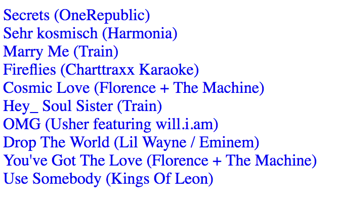

## GraphLab Recommendation System

The purpose of this repository is to provide a real-world example to Graph Lab's recommendation system. Because we want a simplistic model for demonstration, we can use the [item-item recommender](https://turi.com/products/create/docs/generated/graphlab.recommender.item_similarity_recommender.create.html#graphlab.recommender.item_similarity_recommender.create). This demonstration will allow you to run the recommendation system locally, in a web browser. For a real production-ready environment, I would checkout the [Turi Predictive Services](https://turi.com/products/predictive-services/docs/index.html).

We will use the Million Song Dataset Challenge provided by [kaggle](https://www.kaggle.com/c/msdchallenge#description).

### Prerequisites

 - Install [nodejs](https://nodejs.org/en/download/)
 - Install [anacondas](https://www.continuum.io/downloads)
 - Install [graphlab](https://turi.com/download/install-graphlab-create-command-line.html)
  - Be sure to create "`gl-env`" environment verbatim

### Setup

 - Clone this repository onto your machine
 - Download "kaggle_songs.txt" and "kaggle_visible_evaluation_triplets.zip", putting both files in [data](data) directory.
 - From within the root directory of the project, run `npm install` to install all of the nodejs dependencies
 - Use graphlab's conda environment: `source activate gl-env`.
 - Run `node app.js`.
 - Open the url http://localhost:3000/ in your browser.

Running `node app.js` will try to create the recommendation model and save it, if the model has not been saved yet. The node environment will then spawn a child-process of the [get_recommendation.py](get_recommendation.py) python file which waits for input for a `song_id` which will be used to find similar items.

Your browser should display something like this:

